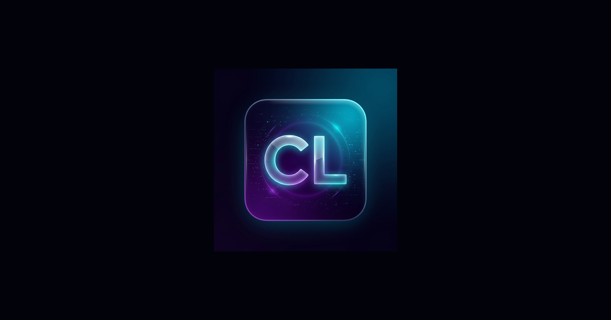

# React + Vite

This template provides a minimal setup to get React working in Vite with HMR and some ESLint rules.

Currently, two official plugins are available:

- [@vitejs/plugin-react](https://github.com/vitejs/vite-plugin-react/blob/main/packages/plugin-react) uses [Oxc](https://oxc.rs)
- [@vitejs/plugin-react-swc](https://github.com/vitejs/vite-plugin-react/blob/main/packages/plugin-react-swc) uses [SWC](https://swc.rs/)

## React Compiler

The React Compiler is not enabled on this template because of its impact on dev & build performances. To add it, see [this documentation](https://react.dev/learn/react-compiler/installation).

## Expanding the ESLint configuration

If you are developing a production application, we recommend using TypeScript with type-aware lint rules enabled. Check out the [TS template](https://github.com/vitejs/vite/tree/main/packages/create-vite/template-react-ts) for information on how to integrate TypeScript and [`typescript-eslint`](https://typescript-eslint.io) in your project.
<div align="center">


# CodeLens

### AI-Powered Code Analysis Dashboard

[](https://your-domain.com)
[](LICENSE)
[](https://reactjs.org)
[](https://firebase.google.com)
[](https://anthropic.com)

*Paste any code. Get instant AI-powered analysis, bug detection, quality scores, and actionable suggestions — all in your browser.*



</div>

---

## What is CodeLens?

CodeLens is a premium, developer-focused web application that gives you a full breakdown of any code you paste into it — instantly, in the browser, with no backend required. Whether you're a student learning to write clean code, a professional reviewing a pull request, or a team lead doing a quick audit, CodeLens gives you the insights you need in seconds.

Built with a deep space aesthetic and powered by Claude AI, it combines static analysis with AI intelligence to deliver a code review experience that feels like a $10,000 SaaS tool.

---

## Features

### Core Analysis Engine
- **Code Size Metrics** — total lines, code vs comment vs blank line breakdown, file size in bytes
- **Complexity Analysis** — Big-O time and space complexity, cyclomatic score, nesting depth
- **Bug Detection** — flags common issues with severity levels: Critical, Warning, and Info
- **Quality Score** — 0–100 score based on bugs, complexity, comments, and best practices
- **Performance Insights** — memory usage estimate, CPU intensity, readability and maintainability scores

### AI-Powered Features
- **AI Code Explainer** — plain-English explanation of what your code does, line by line
- **AI Refactor** — Claude rewrites your code to be cleaner and more idiomatic
- **AI Bug Fixer** — one-click fix for detected bugs with a before/after diff view
- **AI Code Review** — feedback from Claude as a senior developer doing a PR review
- **Natural Language to Code** — describe what you want, get working code generated instantly
- **AI Error Dictionary** — paste any error or stack trace, get a plain-English explanation and fix

### Developer Utility Tools
- **Code Formatter** — auto-indent and clean up messy code for any language
- **Code Minifier** — compress JS/CSS and see size reduction percentage
- **Regex Tester** — live match highlighting as you type
- **JSON / YAML Validator** — validate and pretty-print with error line numbers
- **Base64 & Hash Encoder** — encode, decode, MD5, SHA256 instantly
- **Token Counter** — estimate token usage for GPT-4, Claude, and Llama models
- **Big-O Complexity Chart** — animated growth curve visualizer for all complexity classes

### Visualization
- **Code Heatmap** — color-coded line-by-line complexity overlay on the editor
- **Dependency Graph** — interactive SVG node graph of function calls
- **Big-O Growth Chart** — animated Recharts curve for detected complexity
- **Score Trend Sparkline** — tracks your quality score across multiple analyses

### Comparison & History
- **Before / After Diff Viewer** — side-by-side comparison with changed lines highlighted
- **Analysis History** — persistent across sessions via Firestore, paginated
- **Score Tracker** — mini chart showing score improvements over time

### Export & Sharing
- **Export as PDF** — branded report with all metrics
- **Copy as Markdown** — paste results into GitHub PRs or Notion
- **Shareable Link** — base64-encoded URL to share any analysis snapshot
- **Embed Badge** — quality score badge for your README

### Gamification & Learning
- **Code Challenge Mode** — 10 challenges scored on correctness, efficiency, and quality
- **Leaderboard** — top scores with nicknames stored locally
- **Achievement Badges** — First Analysis, Bug Hunter, Clean Coder, Polyglot, Refactor Pro
- **Best Practice Library** — explains why each suggestion matters with good/bad examples
- **Language Cheat Sheets** — quick syntax reference for 7 major languages

### Authentication & Security
- Email and password sign-in with password strength meter
- Google OAuth sign-in
- Firebase App Check with reCAPTCHA v3
- Restrictive Firestore security rules — users can only access their own data
- Rate limiting on AI features — 20 requests per hour per session
- Input sanitization — strips null bytes, limits to 50,000 characters, warns on secret patterns

---

## Tech Stack

| Layer | Technology |
|---|---|
| Frontend | React 18, Tailwind CSS |
| Code Editor | Monaco Editor (same engine as VS Code) |
| AI | Anthropic Claude API (claude-sonnet-4-6) |
| Auth | Firebase Authentication (Email + Google OAuth) |
| Database | Cloud Firestore |
| Security | Firebase App Check, reCAPTCHA v3 |
| Charts | Recharts |
| PDF Export | jsPDF |
| Typography | Space Grotesk, Inter, JetBrains Mono |
| Hosting | Vercel / Netlify / Firebase Hosting |

---

## Supported Languages

Python · JavaScript · TypeScript · C · C++ · Java · Go · Rust · Ruby · PHP · Swift · Kotlin · C# · Bash · SQL · HTML · CSS

---

## Getting Started

### Prerequisites

- Node.js 18 or higher
- npm or yarn
- A Firebase project with Auth and Firestore enabled
- An Anthropic API key

### Installation

```bash
# Clone the repository
git clone https://github.com/YOUR-USERNAME/codelens.git

# Navigate into the project
cd codelens

# Install dependencies
npm install
```

### Environment Setup

Create a `.env` file in the root directory:

```env
REACT_APP_FIREBASE_API_KEY=your_firebase_api_key
REACT_APP_FIREBASE_AUTH_DOMAIN=your_project_id.firebaseapp.com
REACT_APP_FIREBASE_PROJECT_ID=your_project_id
REACT_APP_FIREBASE_STORAGE_BUCKET=your_project_id.appspot.com
REACT_APP_FIREBASE_MESSAGING_SENDER_ID=your_sender_id
REACT_APP_FIREBASE_APP_ID=your_app_id
REACT_APP_ANTHROPIC_KEY=your_anthropic_api_key
REACT_APP_RECAPTCHA_SITE_KEY=your_recaptcha_v3_site_key
```

> Never commit your `.env` file. It is already in `.gitignore`.

### Firebase Setup

1. Go to [Firebase Console](https://console.firebase.google.com) and create a project
2. Enable **Authentication** → turn on Email/Password and Google providers
3. Enable **Firestore Database** in production mode
4. Deploy the security rules from `firestore.rules`
5. Enable **App Check** with reCAPTCHA v3
6. Copy your web app config into the `.env` file

### Run Locally

```bash
npm start
```

Open [http://localhost:3000](http://localhost:3000) in your browser.

### Build for Production

```bash
npm run build
```

---

## Project Structure


---

## Security

CodeLens is built with security as a priority:

- **No full code stored** — only the first 200 characters of each analysis are saved to Firestore
- **User data isolation** — Firestore rules ensure users can never read or write another user's data
- **API key protection** — all keys live in environment variables, never in source code
- **Input sanitization** — code input is sanitized before any API call
- **Rate limiting** — AI features are limited to 20 requests per hour per session
- **App Check** — Firebase App Check with reCAPTCHA v3 prevents API abuse
- **XSS prevention** — no `dangerouslySetInnerHTML` used anywhere in the codebase

To report a security vulnerability, please email **security@your-domain.com** rather than opening a public issue.

---

## Deployment

### Deploy to Vercel (Recommended)

```bash
# Install Vercel CLI
npm install -g vercel

# Deploy
vercel

# Set environment variables in Vercel dashboard
# Project Settings → Environment Variables → add all vars from .env
```

### Deploy to Netlify

```bash
# Build the project
npm run build

# Drag the build/ folder into Netlify dashboard
# Or connect your GitHub repo for automatic deployments
# Add environment variables in Site Settings → Environment Variables
```

### Deploy to Firebase Hosting

```bash
# Install Firebase CLI
npm install -g firebase-tools

# Login and initialize
firebase login
firebase init hosting

# Deploy
firebase deploy
```

After deploying, add your production domain to:
- Firebase Console → Authentication → Authorized Domains
- Google Cloud Console → Credentials → OAuth 2.0 → Authorized JavaScript Origins

---

## Environment Variables Reference

| Variable | Description | Required |
|---|---|---|
| `REACT_APP_FIREBASE_API_KEY` | Firebase web API key | Yes |
| `REACT_APP_FIREBASE_AUTH_DOMAIN` | Firebase auth domain | Yes |
| `REACT_APP_FIREBASE_PROJECT_ID` | Firebase project ID | Yes |
| `REACT_APP_FIREBASE_STORAGE_BUCKET` | Firestore storage bucket | Yes |
| `REACT_APP_FIREBASE_MESSAGING_SENDER_ID` | Firebase sender ID | Yes |
| `REACT_APP_FIREBASE_APP_ID` | Firebase app ID | Yes |
| `REACT_APP_ANTHROPIC_KEY` | Anthropic Claude API key | Yes |
| `REACT_APP_RECAPTCHA_SITE_KEY` | reCAPTCHA v3 site key | Yes |

---

## Contributing

Contributions are welcome! Please follow these steps:

1. Fork the repository
2. Create a feature branch: `git checkout -b feature/your-feature-name`
3. Commit your changes: `git commit -m 'Add: your feature description'`
4. Push to the branch: `git push origin feature/your-feature-name`
5. Open a Pull Request

Please make sure your code passes `npm run build` with no errors before submitting.

---

## Roadmap

- [ ] VS Code Extension
- [ ] GitHub PR integration — analyze diffs directly
- [ ] Team workspaces with shared analysis history
- [ ] Support for file upload (analyze full project folders)
- [ ] CLI version for terminal-based analysis
- [ ] Webhook support for CI/CD pipeline integration
- [ ] Multi-language mixed file analysis

---

## License

This project is licensed under the MIT License. See the [LICENSE](LICENSE) file for details.

---

## Acknowledgements

- [Anthropic](https://anthropic.com) — Claude AI powering all AI features
- [Firebase](https://firebase.google.com) — Auth and database infrastructure
- [Monaco Editor](https://microsoft.github.io/monaco-editor/) — The VS Code editor engine
- [Recharts](https://recharts.org) — Chart visualizations
- [Space Grotesk](https://fonts.google.com/specimen/Space+Grotesk) — Primary display font

---

<div align="center">

Built with passion by **Nithiezz**

[](https://github.com/YOUR-USERNAME)

*© 2026 CodeLens AI. Precision Static Analysis.*

</div>
